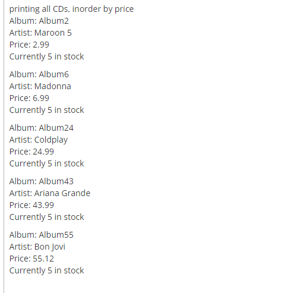

This CD binary search tree was one of the many projects I did during my time in ICS 211 at Leeward Community College. The project took most of the material from the course and compiled it into one project. Some of the things that were used were objects, constructors, nodes, both overloaded and recursive methods, classes, and different binary tree traversals.

The CD binary search tree is similar to owning a record store. It allowed the user to add however many CDs they wanted as long as they provided the album name, artist, price, and how many copies of that CD they wanted to keep in stock. The code would then add the albums while checking if any duplicate CDs were being added. It would then put all the CDs in order by price and neatly print out the information of each CD as shown in the picture. Lastly, the user can tell it to look for a certain CD and it will return whether it was found or not, if the CD was found then it will also print out the information about it.

At first, I had difficulty wrapping my mind around binary search trees but this project was a great opportunity for me to gain a better understanding of how binary search trees functioned. It also provided me the confidence to work with binary search trees in future projects. 
