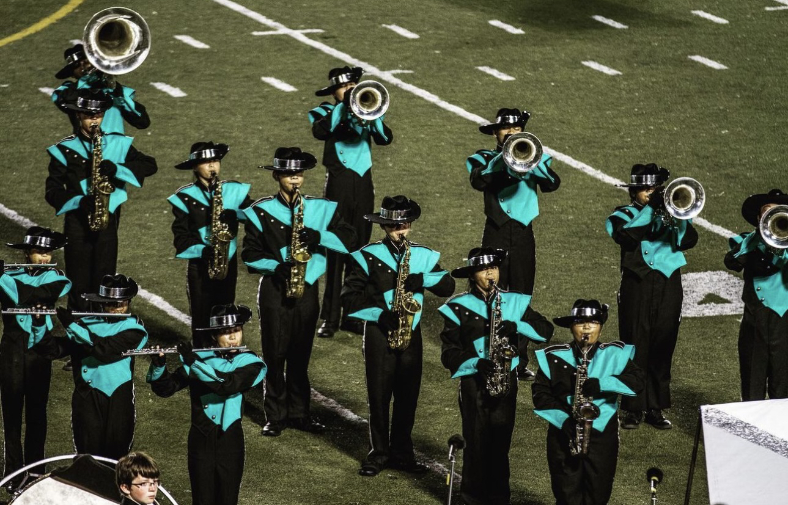
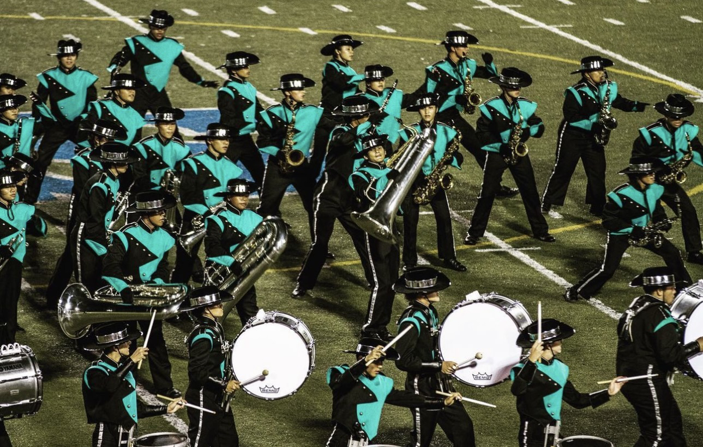
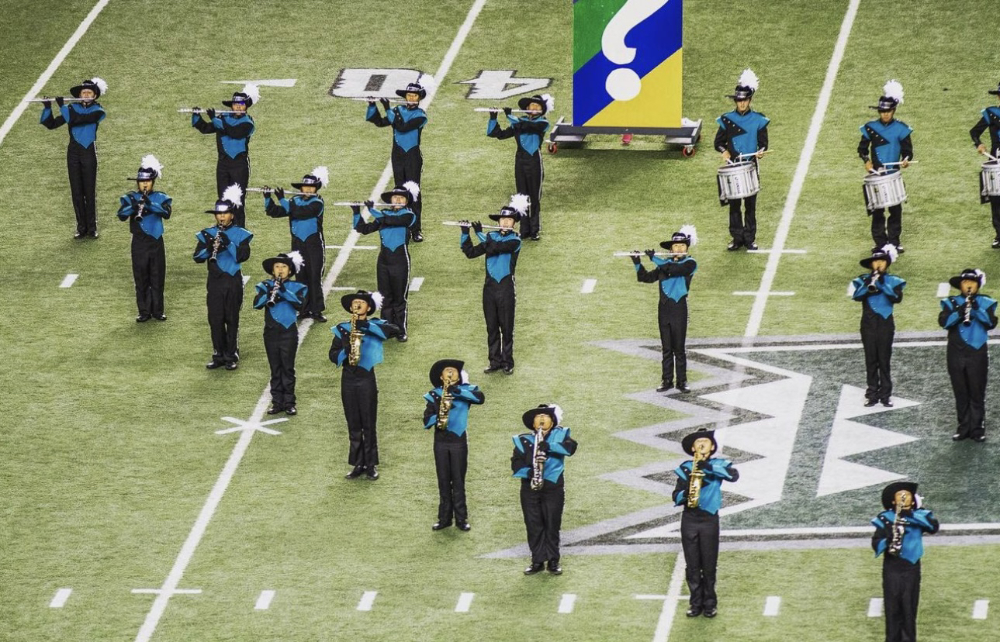

  
  
  

Throughout my years attending Kapolei High School, I was a part of the Kapolei Marching Band. All four years, from 2017 to 2021, I played the Alto Saxophone and was part of the saxophone section which included students who played Alto Saxophones and Tenor Saxophones. In some bands they even have a Baritone Saxophone which is the largest and lowest pitch saxophone, unfortunately, our band did not have anyone who played. Each year we would perform a different show which consists of a different theme, music, and choreography. During my time in high school, the shows that I participated in were: 

Journey To The Moon (2017)
Everest (2018)
What If? (2019)

We would compete with other high school marching bands and perform at different campuses, even the Aloha Stadium and at UH Manoa.

In my last two years of high school, I became the Saxophone Section Leader. My role was to help teach the saxophone players to perfect their marching technique, go over choreography, and memorize music. Aside from our shows, we also participated in parades such as the Honolulu City Lights Parade and the Kapolei City Lights Parade. 

Marching band allowed me to meet many new people both from Kapolei and other schools across the island. Competitions connected students who had the same interests and who enjoyed performing for others. I even created friendships with others that I still keep in touch with to this day. This leadership position not only provided me with leadership skills but also perseverance and dedication. I carried these skills and used them in previous jobs I acquired and even in clubs.
